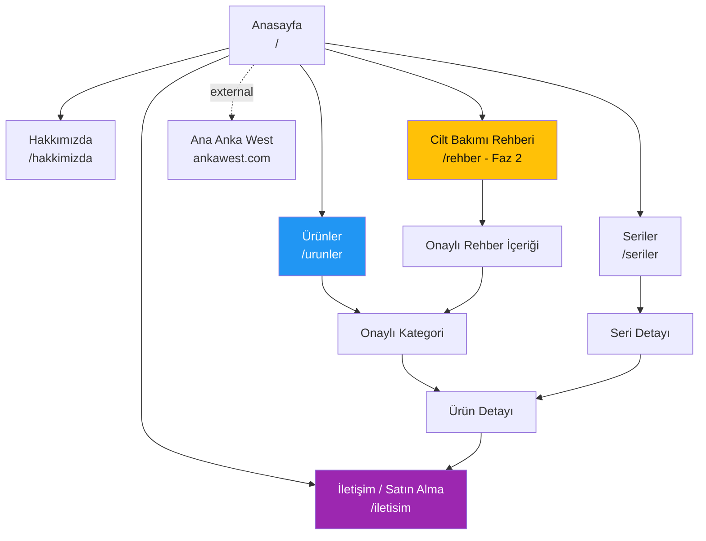

# Anka West Skincare Site Architecture

**Version:** v1  
**Updated:** 2026-08-28  
**Status:** Provisional catalogue architecture. Product inventory, domain and commercial model must be approved before route implementation.

## Working Assumptions

- The first release is a Turkish catalogue + commercial CTA, not a full e-commerce application.
- Both frontends are developed in parallel, but Anka West Skincare launches before the replacement main Anka West site.
- The site has its own domain, frontend deployment, content model, database boundary and public R2 bucket.
- It contains only creams and skincare products; no injectable products or doctor Academy content.
- Product facts, cosmetic claims, category names and visuals will come from an approved inventory—not be inferred from Instagram.
- If cart, payment, stock and orders enter near-term scope, the backend separation decision must be reviewed before implementation.

## Page Hierarchy

```text
Anasayfa (/)
├── Ürünler (/urunler)
│   ├── [Onaylı Kategori] (/urunler/{category-slug})
│   │   └── [Ürün] (/urunler/{category-slug}/{product-slug})
│   └── [Diğer Onaylı Kategoriler]
├── Seriler (/seriler) [yalnız birden fazla anlamlı seri varsa]
│   └── [Seri] (/seriler/{series-slug})
├── Hakkımızda (/hakkimizda)
├── İletişim / Satın Alma Bilgisi (/iletisim)
├── Cilt Bakımı Rehberi (/rehber) [faz 2]
│   └── [Onaylı İçerik] (/rehber/{article-slug})
├── Gizlilik Politikası (/gizlilik-politikasi)
├── KVKK Aydınlatma Metni (/kvkk-aydinlatma-metni)
├── Çerez Politikası (/cerez-politikasi)
└── Kullanım / Satış Koşulları (/kullanim-kosullari) [ticari modele göre]

Ana Anka West (external)
└── Medikal estetik ürünleri ve doktor Akademisi (https://www.ankawest.com/)

Yönetim Alanı (/admin) [navigasyonda yok + noindex]
└── Skincare kategorileri, serileri, ürünleri ve site içeriği
```

`{category-slug}` ve `{product-slug}` gerçek public URL önerileri değildir. Bunlar, onaylı ürün envanteri alındıktan sonra doldurulacak route şablonlarıdır.

## Visual Sitemap



## URL Map

| Page type | URL | Parent | Nav location | Priority | Phase | Indexing |
| --- | --- | --- | --- | --- | --- | --- |
| Homepage | `/` | — | Logo | Critical | 1 | Index |
| Product hub | `/urunler` | Homepage | Header | Critical | 1 | Index |
| Product category | `/urunler/{category-slug}` | Products | Header dropdown | High | 1 | Index |
| Product detail | `/urunler/{category-slug}/{product-slug}` | Category | Contextual | Critical | 1 | Index |
| Series hub | `/seriler` | Homepage | Header if needed | Medium | 1 | Index |
| Series detail | `/seriler/{series-slug}` | Series | Contextual | High | 1 | Index |
| About | `/hakkimizda` | Homepage | Header/Footer | Medium | 1 | Index |
| Contact/purchase info | `/iletisim` | Homepage | Header CTA | Critical | 1 | Index |
| Guide hub | `/rehber` | Homepage | Header/Footer | Medium | 2 | Index |
| Guide article | `/rehber/{article-slug}` | Guide | Contextual | Medium | 2 | Index |
| Legal | Turkish legal slugs | Homepage | Footer | Required | 1 | Index unless counsel says otherwise |
| Admin | `/admin/**` | — | None | Internal | Later | Noindex + auth + mandatory 2FA |

Do not implement `/sepet`, `/odeme`, `/hesabim`, order or stock routes until the commercial model explicitly includes e-commerce.

## Navigation Specification

### Public Header

Recommended initial order:

1. Ürünler — category dropdown only after real categories are approved.
2. Seriler — include only if the inventory contains multiple useful product series.
3. Hakkımızda.
4. `Satın Alma Bilgisi` or `İletişime Geç` — rightmost CTA after the conversion decision.

Utilities: a clearly labelled external `Anka West` link. Do not show Akademi or medikal injectable categories in this navigation.

Mobile navigation uses a labelled menu button and accordion only when nested categories exist. The commercial CTA remains easy to reach.

### Footer

- **Ürünler:** approved categories and product hub.
- **Marka:** Hakkımızda and, if approved, series pages.
- **Destek:** contact/purchase information and later FAQ.
- **Keşfet:** guide content only after medically/cosmetically reviewed copy exists.
- **Yasal:** privacy, KVKK, cookies and applicable sales/usage terms.
- **Anka West:** external corporate site link for professional medical aesthetic products and Academy.

### Breadcrumbs

Use visible breadcrumbs and `BreadcrumbList` JSON-LD:

- `Anasayfa > Ürünler > Kategori > Ürün Adı`
- `Anasayfa > Seriler > Seri Adı`
- `Anasayfa > Cilt Bakımı Rehberi > İçerik Başlığı`

## Internal Linking Plan

### Hubs and Spokes

- `/urunler` links to every approved category.
- Each category links to its products and back to `/urunler`.
- Each product links to its category, related products, relevant series and the selected commercial CTA.
- Each series page links to every product in that series; products link back to the series.
- Phase 2 guide content links only to relevant products/categories and includes an editorial/claim approval step.

### Cross-site Linking

- Main Anka West's Skincare mention and old `/kremler` records link to their exact new destination.
- Skincare footer links to the main Anka West corporate homepage.
- Skincare must not query or duplicate Academy/member content.
- Cross-domain links use descriptive labels; do not disguise an external destination as an internal product page.

### Orphan Prevention

- Every published product belongs to one primary category.
- Every series is linked from at least one product and, when important, the series hub.
- Draft records return 404 publicly and are excluded from the generated sitemap.
- Products removed without a replacement use an intentional 410 or a genuinely equivalent category redirect—not an automatic homepage redirect.

## Search and Filter Boundary

Do not add a search package in the first scaffold. Once the approved inventory is known:

- Fewer than roughly 30 products: category navigation and a simple server-rendered filter may be enough.
- Larger/more complex inventory: define filter dimensions from real attributes before choosing a search service.
- Filter query parameters should not create thousands of indexable duplicate combinations.

## Redirect and Migration Plan

| Current Anka West URL | New Skincare target | Behavior | Status |
| --- | --- | --- | --- |
| `/kremler` | Exact Skincare collection/category URL | Cross-domain 301 after target is live | Target pending |
| `/kremler/i-am-a-title-01` | Exact Glutanex series or product URL | Cross-domain 301 | Target pending |
| Other legacy skincare details | One-to-one matching product URL | Cross-domain 301 | Full inventory required |
| Main `/urunler` Skincare card | Relevant Skincare landing/category | Normal external link or removal | Final UX decision pending |

Migration rules:

1. Launch the final Skincare URLs first.
2. Verify that every target returns 200 and has approved canonical metadata.
3. Add one-hop permanent redirects on the old host.
4. Preserve query strings where meaningful.
5. Test old URLs individually and monitor 404/redirect traffic.
6. Do not redirect every old product to the Skincare homepage.

## Indexing and Metadata Rules

- Use the final domain in canonical URLs only after it is approved.
- Generate sitemap entries only for published pages.
- Product pages need unique title, description, H1 and approved image alt text.
- Structured data type depends on the commercial model. Do not claim `Offer`, price or availability before e-commerce/stock data exists.
- Avoid medical efficacy claims in metadata unless approved evidence and regulatory review support them.
- Turkish is the provisional launch language. Do not create empty `/en` copies; add English only with approved translated content.

## Content Model Inputs Required

Before category or product routes are built, obtain a spreadsheet/export containing:

- Brand and series.
- Product display name and preferred slug.
- Primary category and any secondary discovery tags.
- Short and long approved descriptions.
- Ingredient/content list in the required legal format.
- Usage instructions and warnings approved for publication.
- Package size/variants.
- Product images and usage rights.
- Approved claims, proof references and prohibited wording.
- Purchase/contact destination.
- Current Anka West or Instagram reference URL.
- Publication status and display order.

## Decisions Required Before Feature Implementation

- Final domain and canonical host.
- B2C, B2B or hybrid audience priority.
- Catalogue, sales-point referral or full e-commerce model.
- Primary CTA and the team/process receiving the lead or order.
- Complete approved product/series/category inventory.
- Turkish-only or multilingual roadmap.
- Exact old-to-new `/kremler` URL mapping.
- Legal review owner for cosmetic claims, privacy, cookies and commercial terms.
